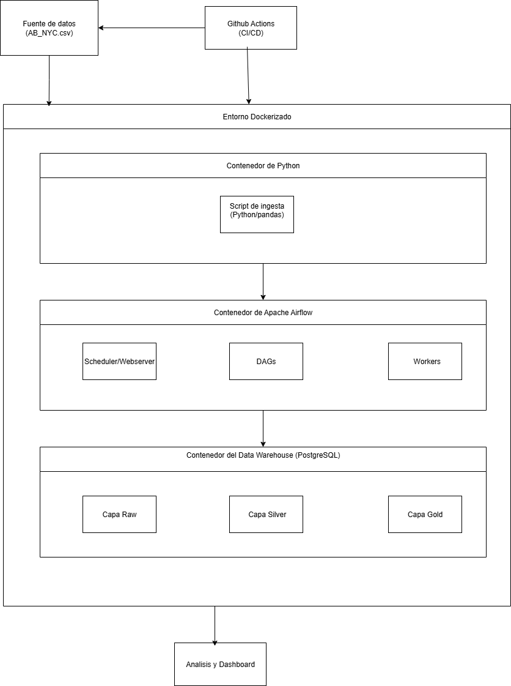

### **Diseño de la Arquitectura del Pipeline ELT**

#### **1. Visión General de la Arquitectura**

El pipeline de datos estará diseñado para procesar el dataset `AB_NYC.csv` de manera eficiente, robusta y escalable. La arquitectura se basa en el patrón **ELT (Extract, Load, Transform)** y se desplegará utilizando **Docker** para garantizar la portabilidad y la consistencia entre entornos. La orquestación central se realizará con **Apache Airflow**, y se implementarán flujos de **CI/CD** con **GitHub Actions**.

---

#### **2. Diagrama de la Arquitectura (poner en modo claro si no se ve bien)**

---

#### **3. Definición de las Capas del Data Warehouse**

El Data Warehouse estará estructurado en tres capas principales para asegurar un procesamiento de datos organizado y de calidad.

* **Capa Raw (Staging):**
    * **Propósito:** Almacenar los datos tal y como se extraen del archivo `AB_NYC.csv`. Esta capa es una réplica exacta de la fuente de datos.
    * **Rol:** Sirve como zona de aterrizaje, punto de partida para cualquier proceso de transformación posterior y como fuente para auditorías. Los datos aquí son inmutables.
* **Capa Silver (Transformación):**
    * **Propósito:** Limpiar, estandarizar y enriquecer los datos de la capa `Raw`. Se aplican transformaciones como la corrección de tipos de datos, el manejo de valores nulos, la normalización de campos y la eliminación de duplicados.
    * **Rol:** Preparar los datos para el análisis, asegurando que sean consistentes y de alta calidad.
* **Capa Gold (Data Mart):**
    * **Propósito:** Crear un modelo de datos final, optimizado para el análisis. Se construirán tablas de hechos y dimensiones para responder a preguntas de negocio específicas.
    * **Rol:** Ser la única fuente de verdad para analistas de negocio y científicos de datos. Las tablas de esta capa estarán listas para alimentar dashboards y modelos de Machine Learning.

---

#### **4. Justificación de la Selección de Herramientas y Tecnologías**

* **Docker y Docker Compose:**
    * **Portabilidad y Consistencia:** Garantiza que el pipeline funcione de la misma manera en cualquier entorno (desarrollo, testing, producción), eliminando problemas de dependencias.
    * **Escalabilidad y Flexibilidad:** Los contenedores permiten escalar los servicios de manera independiente.
* **Python y `pandas`:**
    * **Facilidad de Integración y Rendimiento:** `pandas` es la biblioteca estándar de Python para la manipulación y análisis de datos. Su uso en el script de ingesta es eficiente.
* **SQL:**
    * **Rendimiento y Adecuación:** Las transformaciones de datos a gran escala se realizan de manera eficiente directamente en la base de datos utilizando SQL.
* **Apache Airflow:**
    * **Orquestación y Mantenibilidad:** Permite definir los flujos de trabajo de forma programática como DAGs, lo que hace el pipeline fácil de monitorear, programar y mantener.
* **GitHub Actions:**
    * **Automatización de CI/CD:** Facilita la automatización de la integración y el despliegue continuo, garantizando la calidad y la trazabilidad del proyecto.

---

#### **5. Análisis de la Fuente de Datos**

El dataset `AB_NYC.csv` contiene información clave sobre listados de Airbnb, lo que nos permitirá responder a preguntas de negocio como:

* Precios promedio por tipo de habitación y por barrio.
* Relación entre el precio, el número de reseñas y la disponibilidad.
* Distribución geográfica de los listados y sus características.

Este análisis guiará el diseño del esquema de la capa `Gold` y la construcción del dashboard final.